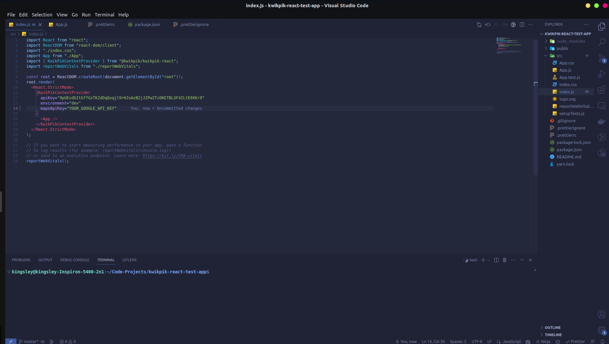
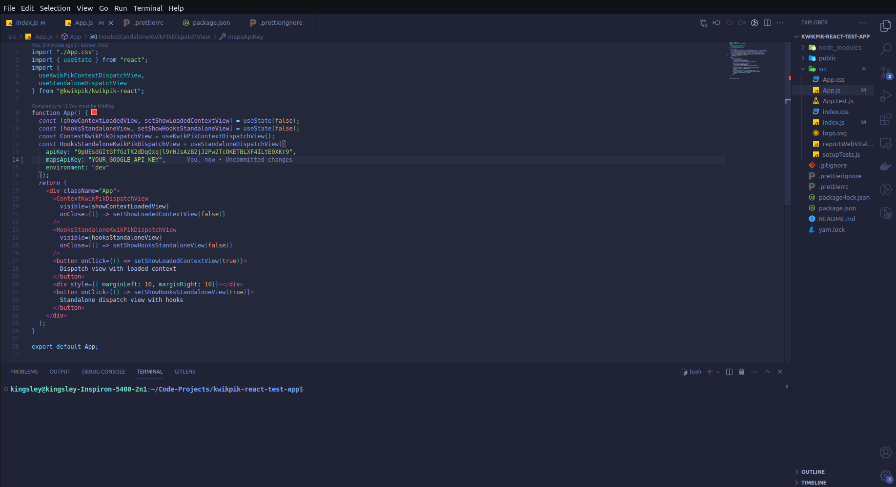

<p align="center"></p>

# kwikpik-react


## Introduction

`kwikpik-react` is a simple and convenient React library that provides an interface through which users can interact with the Kwik Pik's gateway. If you aim to provide logistic services to users without hassle, then this library is for you React lovers.

## Table of Content

1. [Installation](#installation)
2. [Overview & Usage](#overview--usage)

## Installation

The package can be installed using traditional package managers like `npm` and `yarn` like so:

```sh
npm install --save @kwikpik/kwikpik-react
```

or

```sh
yarn add @kwikpik/kwikpik-react
```

## Overview & Usage

`kwikpik-react` can only be used in an app that uses the React library. It provides a custom button, a context provider and a dispatch view.

### KwikPikContextProvider

The context provider makes it convenient to provide the global/app-wide configuration necessary to interact with the Kwik Pik gateway from a client-side. The configuration can be loaded using any of `useKwikPikContext` or `useContextDispatchView`. The first allows to just load the values from the provided configuration whereas the second returns an already configured `DispatchView`.

The following props are passed to the `KwikPikContextProvider` component:

| Prop        | Type                                | Description                                                                                   |
| ----------- | ----------------------------------- | --------------------------------------------------------------------------------------------- |
| apiKey      | string                              | Your API key gotten from the business dashboard                                               |
| mapsApiKey  | string                              | Your Google Maps API key. This is necessary for the autocomplete & geocoding features to work |
| environment | "dev"&#124; "prod" &#124; undefined | The environment to use. dev (Development) or prod (Production). Defaults to "prod".           |

Example



The `useKwikPikContext` function can be used to retrieve the values of these props like so

```jsx
// Removed for brevity
const { apiKey, mapsApiKey, environment } = useKwikPikContext();
```

You can use the `useContextDispatchView` function to create a configured `DispatchView`. The following optional props can be passed to the created component

| Prop    | Type     | Description                                                        |
| ------- | -------- | ------------------------------------------------------------------ |
| visible | boolean  | Whether the dispatch modal is visible or not                       |
| onClose | function | Function that gets executed when the "x" labeled button is clicked |



From the snapshot above, you can see that it is also possible to use a standalone dispatch view that doesn't depend on a context provider by calling `useStandaloneDispatchView`.

You can also use the `DispatchView` component directly and configure it like so:

```jsx
import { DispatchView } from "@kwikpik/kwikpik-react";

<DispatchView
  apiKey="YOUR_API_KEY"
  mapsApiKey="YOUR_GOOGLE_MAPS_API_KEY"
  environment="prod"
  visible={true | false}
  onClose={() => {
    // Do something here
  }}
/>;
```


